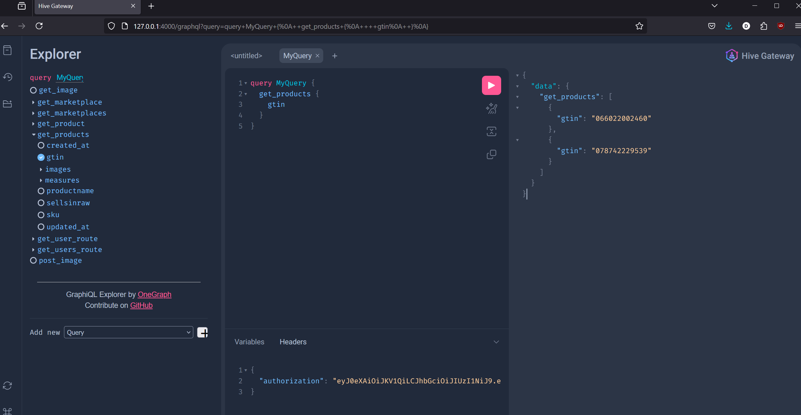

# gateway

Followed instructions at: https://the-guild.dev/graphql/mesh/v1/getting-started

## Development
```sh
bun run compose
```

## Running
```sh
# if you want to use bun
bun run hive-gateway supergraph

# if you want to use docker
docker build -t gateway -f Dockerfile.local .
docker run -p 4000:4000 --env-file .env --add-host "host.docker.internal:host-gateway" gateway
```

NOTE THE LACK OF `Bearer ` prefix. TODO fix this bug? LOL! @codyduong
