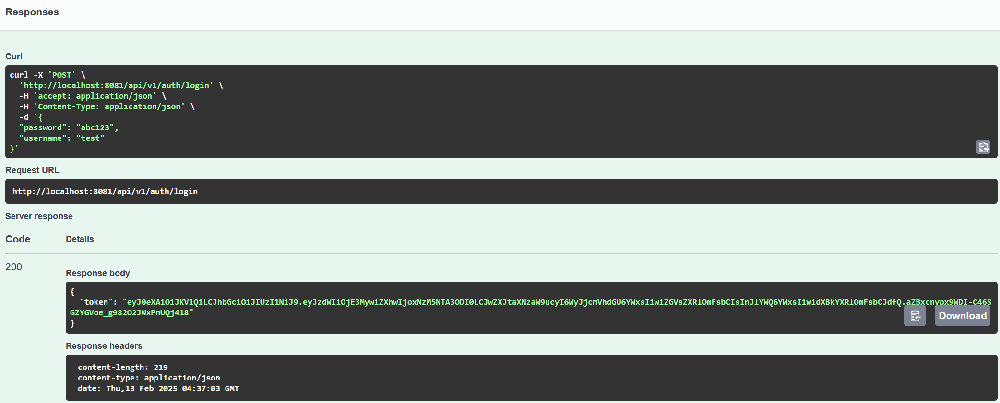

# Authorizing `test` user

For context, most of our endpoints are secured by a jsonwebtoken (JWT), which
you must first obtain from our auth api.

0. Assumes the backend microservices are running based on the tutorial in the 
   [README.md](../../README.md#starting-backendmicroservices)

0. While not necessary it is recommended to have created a DB connection in
   the [Connecting to DB with pgAdmin 4](../pgadmin/pgadmin.md) tutorial.

1. Visit http://localhost:8081/swagger-ui/#/, this is the backend/auth endpoint.
   It should look something like this.

   

2. Click this button "POST /api/v1/auth/login" to view the endpoint data for logging in.

   

3. Press "Try it out" and login and fill it out with your test user data.
   - Username is always `test`
   - Password is by default `abc123` but can be configured in `.env`

   Once you have done that you can press "Execute"

   
   
   You should receive a response that looks something like this:

   

   The token `value` is a jsonwebtoken. Copy the value (without the quotes "").

4. Try out an authorized endpoint before and after putting your JWT credentials.

   Endpoints requiring authorization are indicated by the padlock. 
   
   
   
   You can press the padlock or "Authorize" button at the top of the page to enter your JWT.

   