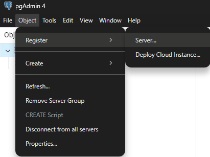
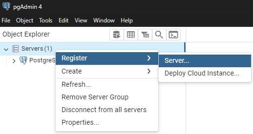
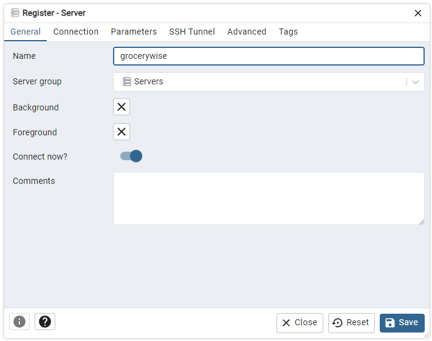
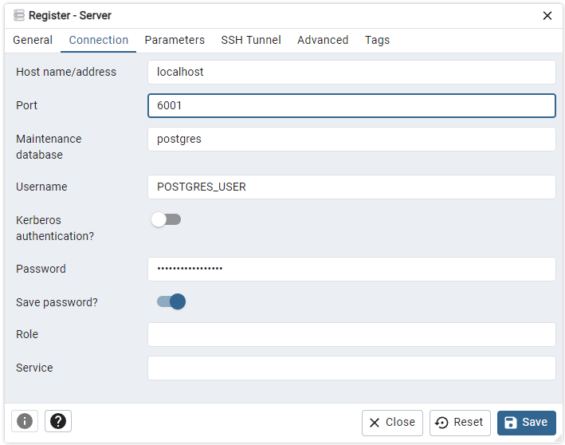
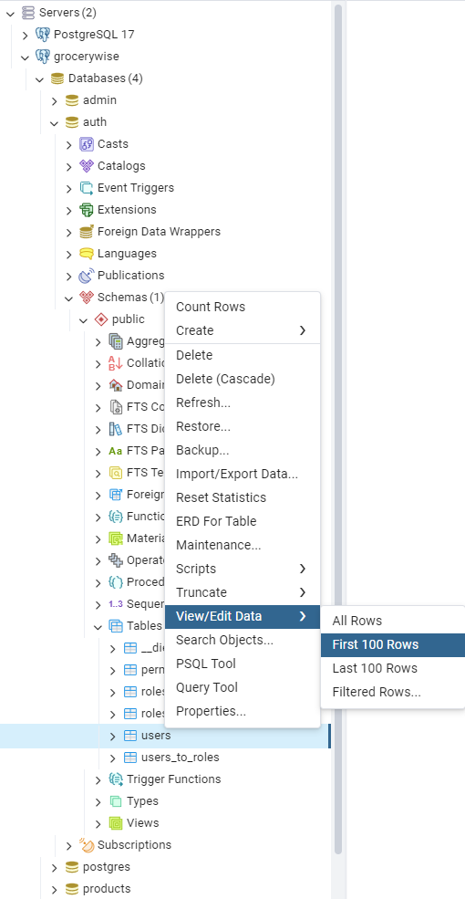
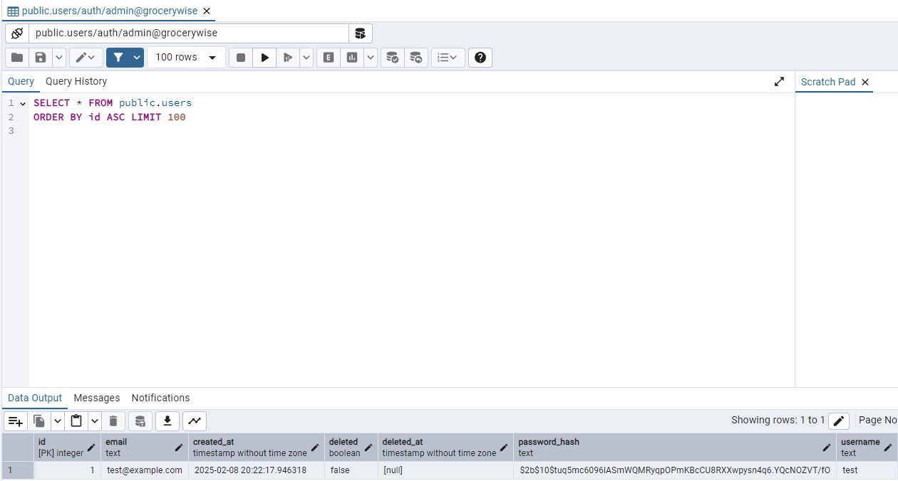

# Connecting to DB with pgAdmin 4

This tutorial is assuming you are using [pgAdmin 4](https://www.pgadmin.org/download/)

0. Assumes the backend microservices are running based on the tutorial in the 
   [README.md](../../README.md#starting-backendmicroservices)

1. Register the new server

Two ways to get here
* `Object > Register > Server`
* Right click `Servers`,     `Register > Server`

  
  

2. Set the general options. You only need to set the `name`, set it to whatever 
   you want. Set `Connect now?` to `false` if your backend microservices are
   not running.

   

3. Add the connection, recall the `POSTGRES_USER` and `POSTGRES_PASSWORD` you 
   set in `.env` and use those values instead. Note that we are using port 6001 
   instead of the default 5432 to avoid collisions with any locally running 
   postgres server. I'd recommend also checking `Save password?` to `true`.

   

4. If all went well you should be able to see the `auth` and `products` (and 
   others).

5. Query `auth.users` to ensure the test user seeded correctly.

   

6. 
You should see something like this. Double check that the 
   `auth.users_to_roles` and `auth.roles_to_permissions` tables were also set up
   correctly, to ensure that the test user has all the permissions to perform
   any action.

   
